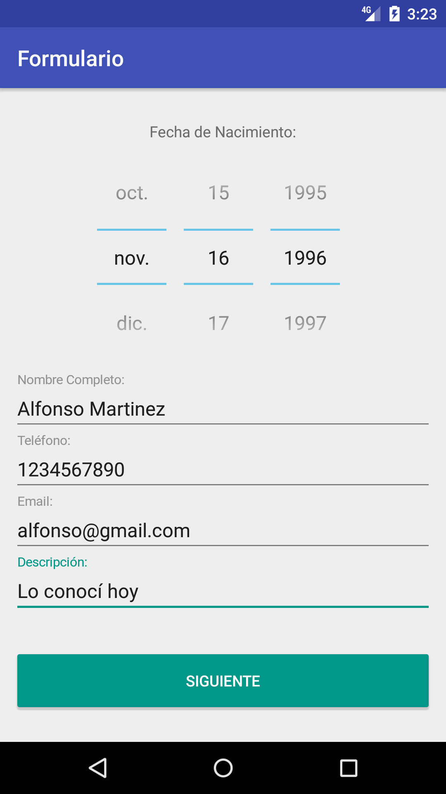
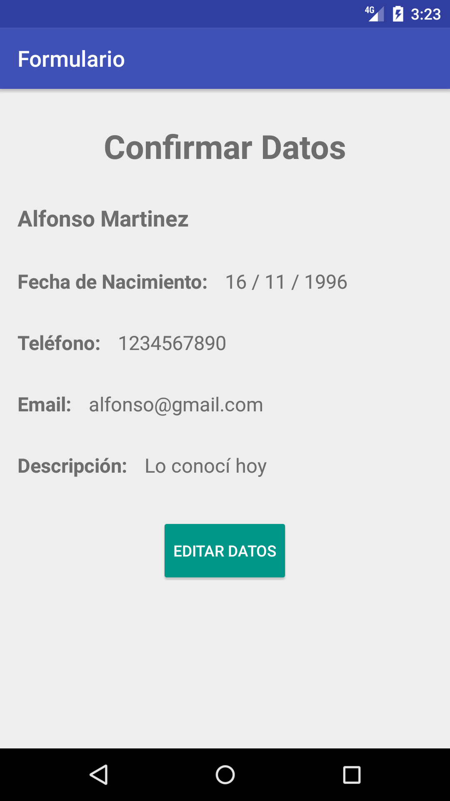

    <h1 class="display-4"><b>Proyecto 2:</b> Formulario Android con Material Design</h1>
    

        

            
        

    

    

        

            
        

        

            
        

    

<link rel="stylesheet" href="https://stackpath.bootstrapcdn.com/bootstrap/4.5.2/css/bootstrap.min.css" integrity="sha384-JcKb8q3iqJ61gNV9KGb8thSsNjpSL0n8PARn9HuZOnIxN0hoP+VmmDGMN5t9UJ0Z" crossorigin="anonymous">